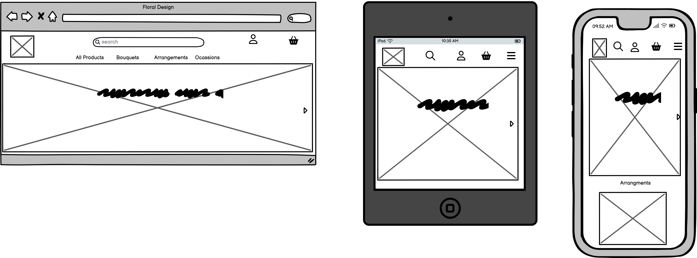
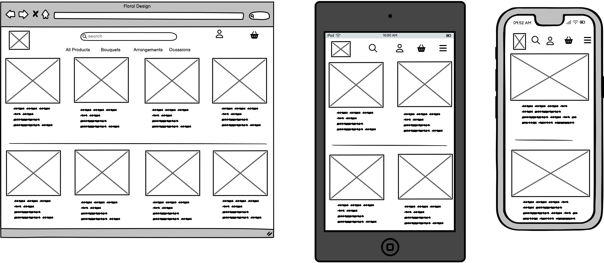
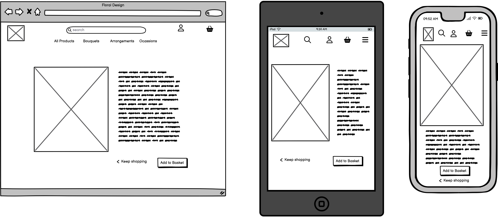
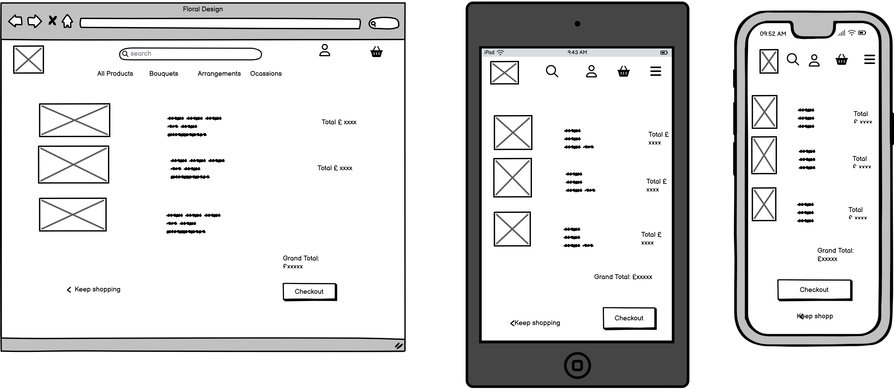
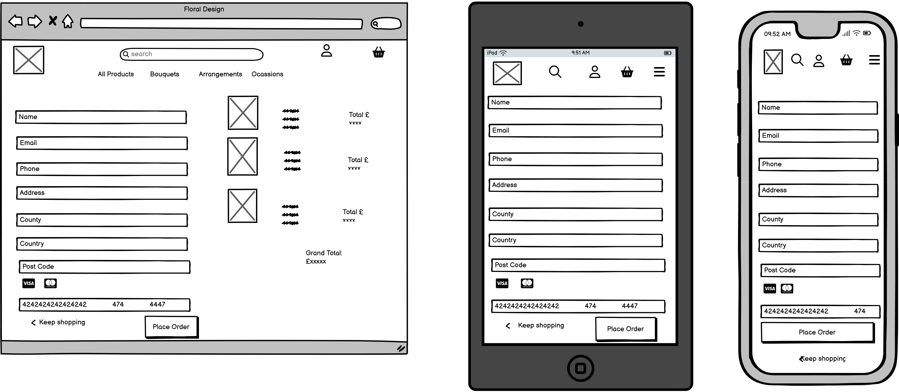
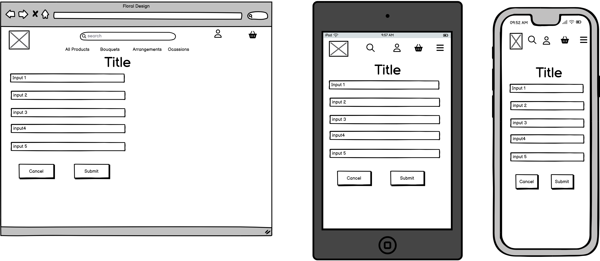

# Fourth Milestone Project


# Floral Design


## Link to live website

[floral design](https://floral-design-abd35de492a3.herokuapp.com/)


## Table of Contents

- [Third Milestone Project](#third-milestone-project)
- [Floral Design](#floral-design)
- [Table of Contents](#table-of-contents)
- [About](#about)
- [Strategy](#strategy)
- [User Experience (UX)](#user-experience-ux)
- [Design](#design)
  - [Colour Scheme](#colour-scheme)
  - [Typography](#typography)
  - [Imagery](#imagery)
  - [Wireframes](#wireframes)
  - [Flowcharts](#flowcharts)
  - [Data Schema](#data-schema)
- [Styles](#styles)
  - [CSS](#css)
- [Floral Design Pages](#floral-design-pages)
  
- [Accessibility](#accessibility)
- [Technologies used](#technologies-used)
- [Deployment and Local Developement](#deployment-and-local-development)
- [Testing](#testing)
- [Bugs](#bugs)
- [Credits](#credits)

## About

Floral Design is a B2C e-commerce store which is built on a buissness in the making, my wife is currently working on opening a flower buissnes. The site at the moment is not for real purchases, but is built with the potential to become fully funtional in the future. The website is designed and implemented with Python and Django, HTML, CSS and some Javascript. It specialises in selling ready made flower arrangements to consumers online. However it has to be noted that this site does not yet sell the products.


## Home Page
![Home page]

### Strategy
* Pack and Stash is a B2C type of business. Due to pressure of life amongst us from work/business, many of us are now opting for online shopping. Floral Design aims to offer flexible online shopping to its customers.


# User Experience (UX)

Floral Design is a Business to Consumer (B2C) e-commerce site.

The sites primary audience will be people who want to be able to shop for a range of flower arangements and designs, in one place.

## User Stories

| User Story ID | User | Should be able to ... | To ... |
| :--- | :--- | :--- | :---|
| **VIEWING & NAVIGATION** |
| 1 | Shopper | View a list of products| Select something to purchase |
| 2 | Shopper | View a specific category of products | Quickly find products I'm interested in without having to search through all products. |
| 3 | Shopper | View individual product details | Identify the price, description, product rating and product image. |
| 4 | Shopper| Quickly identify deals and special offers | Take advantage of special savings on products I'd like to purchase. |
| 5 | Shopper | Easily view the total of my purchases at any time | Avoid spending too much. |
| **REGISTRATION & USER ACCOUNTS** |
| 6 | Site User | Easily register for an account| Have a personal account and profile |
| 7 | Site User | Easily log in or out | Access account information |
| 8 | Site User | Easily recover password | Recover access to account |
| 9 | Site User | Receive an email confirmation after registering | Verify account registration was successful |
| 10 | Site User | Have a personalised user profile | View order history and order confirmations, and save  payment information |
| **REVIEWING PRODUCTS** |
| 11 | Site Owner | Have a plpaced for customer ratings and reviews. | To attract new customers to buy our 5 star rated products. |
| 12 | Site User | Have an ability to review and rate products | To inform other users of the advanteges os disadvantages of any product. |
| 13 | Shopper | Have customer rating and reviews | To see the how content past customers are, with each product. |
| **SORTING & SEARCHING** |
| 14 | Shopper | Sort the list of available products | Easily identify the best rated, best priced and categorically sort products |
| 15 | Shopper | Sort a specific category of product | Find the best-priced or best-rated product in a specific category, or sort the products in that category by name |
| 16 | Shopper | Sort multiple categories of products simultaneously | Find the best-priced or best-rated products across broad categories |
| 17 | Shopper | Search for a product by name or description | Find a specific product I'd like to purchase |
| 18 | Shopper | Easily see what I've searched for and the number of results | Quickly decide whether the product I want is available |
| **PURCHASING & CHECKOUT** |
| 19 | Shopper | Easily select the quantity of a product when purchasing it | Ensure no accidental selection of the wrong product or quantity |
| 20 | Shopper | View items in bag to be purchased | Identify the total cost, and the items of the purchase |
| 21 | Shopper | Adjust the quantity of individual items in the bag| Easily make changes to the purchase before checkout |
| 22 | Shopper | Easily enter payment information | Check out swiftly and easily |
| 20 | Shopper | Feel personal and payment information is safe and secure | Confidently provide the needed information to make a purchase |
| 21 | Shopper | View an order confirmation after checkout | Verify that no mistakes have been made |
| 23 | Shopper | Receive an email confirmation after checking out | Keep a record of the purchase |
| **ADMIN & STORE MANAGEMENT** |
| 24 | Store Owner | Add a product | Add new items to my store |
| 25 | Store Owner | Edit/update a product | Change product prices, descriptions, images and other product criteria |
| 26 | Store Owner | Delete a product | Remove items that are no longer for sale |


# Design

## Colour Scheme

I designed my colour scheme, based on the Floral Design logo. The design I recieved from my client, this logo was previously used by my client for advertising and other buissness needs. Based on the colour of the logo I have designed the website. The pink colour gives users the feeling, they are visitong a safisticated flower e-comerce site. The grey color has a pink undertone wich matches well the main pink colour of the logo.

- I have used `#e6423d` for the most header and nav texts of the web pages.
- I have used `#806161` for side texts and paragraphs.
- I have used `rgba(230, 66, 61, 0.5)` as an opaque version of the main text colour.
- I have used `rgba(128, 97, 97, 0.4)` as an opaque version of the side text colour.
- I have used `rgba(230, 66, 61, 0.3)` for the lighter opaque colour of the footer.
- I have used plain white `#fff` for the white text in the dark background sections of the web pages.
- I have used plain white `#fff` for the white background for many sections of the web pages.


### Typography

* The main font used in this website is Federo. This font is clear to read yet decrative, giving the customer a unique experiance when browsing the products and pages of the site. The font is available in a wide range of weights. The user will never have to strain to read any section.

- - -

* The font is imported from google fonts. [Federo](https://fonts.google.com/?query=Federo) It is used via the import link at the head of the [stylesheet](static/css/base.css). This links all the text across the pages of the website to the appropriate style and font.

* The decrotive font used in this website is Merienda. This font is decrative, giving the customer a unique experiance of a bespoke flower e-comerce site. The font is used for informaiton on the hero image and for the text of the shop now button.

- - -

* The font is imported from google fonts. [Merienda](https://fonts.google.com/?query=Merienda) It is used via the import link at the head of the [stylesheet](static/css/base.css). This links all the text across the pages of the website to the appropriate style and font.

### Imagery

For the hero images i have used two very different images of flower designs, these images on the home cann be changed by clicking on the arrows to the right and left of the hero image. The functions to change images are with [javascript](static/js/base.js). The images come from [pixabay](https://pixabay.com/).

### Product Image

The product images are from a range of sources. Some a from an original photo shoot created by my client for a previous advertisment. Some are flower designs created around the time I was creating the website. Some come from [pixabay](https://pixabay.com/)


## Wireframes

<details>

  <summary>Click here to view Wireframes:</summary>

Wireframes were created for mobile, tablet and desktop using [balsamiq.](https://balsamiq.com/)

### Home Page




---

### Products Page




---

### Product Detail page



---


### Basket page



---


### Checkout page



---


### All Forms

#### All pages on the website, which have forms will all have similar layout.

* Sign up
* Log in
* Contact form
* Add Review
* Admin product add and edit



---

</details>


### Data Schema

<details>
  <summary>Click here to view the data schema:</summary>

Due to the data being used for the project I have opted to use a relational database as this will best suit my requirements.

- I created the schema using the website [drawsql](https://drawsql.app/). The schema shows the data layout and how it is used across the various apps in the website, using ids and foreign keys.


</details>

# Bugs

## solved bugs

| Number | Bug | Failed Attempt to fix | How I fixed the bug |
| :--- | :--- | :--- | :--- |
| 1 | Navbar not showng in mobile. | N/A | After a lot of looking over the code and using devtools, I realised that the includes file link was below the main content in `base.html`. I replaced the link and the nav bar showed in mobile. |

* Product images not loading

* Dev tools showing error in js file

* bug in product_count tag

* bug in message remove jquery

* opening checkout template rendred form error from checkout/views.py

* Messages would not close on login and logout

* Username input bug on reviews form

# Technologies Used

### Languages Used

HTML, CSS, JavaScript, Python

### Database Used

sqlite3 for development.

Code Institute postgresql database for deployed site.

### Frameworks Used

[Django](https://www.djangoproject.com/) - Version 3.2.25- A high-level Python web framework that encourages rapid development and clean, pragmatic design.

[Bootstrap](https://getbootstrap.com/docs/4.6/getting-started/introduction/) - Version 4.6.2 - A framework for building responsive, mobile-first sites.

### Libraries & Packages Used

[jQuery](https://jquery.com/) - Version 3.6.2 - A JavaScript Framework

[Font Awesome](https://fontawesome.com/) - Version 6.2.1 - Used for the iconography of the site, this was added using a CDN link.

[Django Allauth](https://django-allauth.readthedocs.io/en/latest/) - Version 0.55.0 - Used for authentication, registration & account management.

[django-countries](https://pypi.org/project/django-countries/7.2.1/) - Version 7.2.1 - This is the latest stable version that is compatible with GitPod.

[django_crispy_forms](https://pypi.org/project/django-crispy-forms/) - provides a tag and filter that lets you quickly render forms

[gunicorn](https://pypi.org/project/gunicorn/) - a Python WSGI HTTP Server

[pillow](https://pypi.org/project/Pillow/) - Python imaging library

[dj_databsae_url](https://pypi.org/project/dj-database-url/) - allows us to utilise the DATABASE_URL variable

[psycopg2](https://pypi.org/project/psycopg2/) - a postgres database adapter which allow us to connect with a postgres database

[django-storages](https://pypi.org/project/django-storages/) - a storage backend library

[boto3](https://pypi.org/project/boto3/) - Allows connection to AWS S3 bucket


### Programs Used

[Am I Responsive](https://ui.dev/amiresponsive) - To create the responsive images of the site on a variety of device sizes.

[Balsamiq](https://balsamiq.com/) - Used to create wireframes.

[DrawSQL.app](https://drawsql.app/) - Used to create the database schema.

[Favicon.io](https://favicon.io/) - To create the favicon.

[Git](https://git-scm.com/) - For version control.

[GitHub](https://github.com/) - To save and store the files for this project.

[Google Dev Tools](https://developer.chrome.com/docs/devtools/) - To troubleshoot, test features and solve issues with responsiveness and styling.

[Pip](https://pypi.org/project/pip/) - A tool for installing Python packages.

### Stripe

[Stripe](https://stripe.com/gb) has been used in the project to implement the payment system.

Stripe for the website is currently in developer mode, which allows us to be able to process test payments to check the function of the site.

| Type | Card No | Expiry | CVC | ZIP |
| :--- | :--- |:--- | :--- | :--- |
| Success| Visa | 4242 4242 4242 4242 | A date in the future | Any 3 digits | Any 5 digits |
| Require authorisation | 4000 0027 6000 3184 | A date in the future | Any 3 digits | Any 5 digits |
| Declined | 4000 0000 0000 0002 | A date in the future | Any 3 digits | Any 5 digits |

---

# Deployment and Local Development

### Deployment

The project is deployed using Heroku. To deploy the project:

#### **Create the Live Database**

We have been using the sqlite3 database in development, however this is only available for use in development so we will need to create a new external database which can be accessed by Heroku.


#### **Heroku app setup**

  1. From the [Heroku dashboard](https://dashboard.heroku.com/), click the new button in the top right corner and select create new app.
  2. Give your app a name (this must be unique), select the region that is closest to you and then click the create app button bottom left.
  3. Open the settings tab and create a new config var of `DATABASE_URL` and paste the database URL you copied from the Code Institute postgresql database, into the value (the value should not have quotation marks around it).

#### **Preparation for deployment in GitPod**

1. Install dj_database_url and psycopg2 (they are both needed for connecting to the external database you've just set up):

   ```bash
   pip3 install dj_database_url==0.5.0 psycopg2
   ```

2. Update your requirements.txt file with the packages just installed:

    ```bash
    pip3 freeze > requirements.txt
    ```

3. In settings.py underneath import os, add `import dj_database_url`

4. Find the section for DATABASES and comment out the code. Add the following code below the commented out database block, and use the URL copied from elephantSQL for the value:

    (NOTE! don't delete the original section, as this is a temporary step whilst we connect the external database. Make sure you don't push this value to GitHub - this value should not be saved to GitHub, it will be added to the Heroku config vars in a later step, this is temporary to allow us to migrate our models to the external database)

    ```python
    DATABASES = {
        'default': dj_database_url.parse('paste-elephantsql-db-url-here')
    }
    ```

5. In the terminal, run the show migrations command to confirm connection to the external database:

    ```bash
    python3 manage.py runserver
    ```

6. If you have connected the database correctly you will see a list of migrations that are unchecked. You can now run migrations to migrate the models to the new database:

    ```bash
    python3 manage.py migrate
    ```

7. Create a superuser for the new database. Input a username, email and password when directed.

    ```bash
    python3 manage.py createsuperuser
    ```

8. You should now be able to go to the browser tab on the left of the page in elephantsql, click the table queries button and see the user you've just created by selecting the auth_user table.
9. We can now add an if/else statement for the databases in settings.py, so we use the development database while in development (the code we commented out) - and the external database on the live site (note the change where the db URL was is now a variable we will use in Heroku):

    ```python
    if 'DATABASE_URL' in os.environ:
        DATABASES = {
          'default': dj_database_url.parse(os.environ.get('DATABASE_URL'))
        }
    else:
        DATABASES = {
            'default': {
                'ENGINE': 'django.db.backends.sqlite3',
                'NAME': os.path.join(BASE_DIR, 'db.sqlite3')
          }
        }
    ```

10. Install gunicorn which will act as our webserver and freeze this to the requirements.txt file:

    ```bash
    pip3 install gunicorn
    pip3 freeze > requirements.txt
    ```

11. Create a `Procfile` in the root directory. This tells Heroku to create a web dyno which runs gunicorn and serves our django app. Add the following to the file (making sure not to leave any blank lines underneath):

    ```Procfile
    web: gunicorn seaside_sewing.wsgi:application
    ```

12. Log into the Heroku CLI in the terminal and then run the following command to disable collectstatic. This command tells Heroku not to collect static files when we deploy:

    ```bash
    heroku config:set DISABLE_COLLECTSTATIC=1 --app heroku-app-name-here
    ```

13. We will also need to add the Heroku app and localhost (which will allow GitPod to still work) to ALLOWED_HOSTS = [] in settings.py:

    ```python
    ALLOWED_HOSTS = ['{heroku deployed site URL here}', 'localhost' ]
    ```

14. Save, add, commit and push the changes to GitHub. You can then also initialize the Heroku git remote in the terminal and push to Heroku with:

    ```bash
    heroku git:remote -a {app name here}
    git push heroku master
    ```

15. You should now be able to see the deployed site (without any static files as we haven't set these up yet).

16. To enable automatic deploys on Heroku, go to the deploy tab and click the connect to GitHub button in the deployment method section. Search for the projects repository and then click connect. Click enable automatic deploys at the bottom of the page.

#### **Generate a SECRET KEY & Updating Debug**

1. Django automatically sets a secret key when you create your project, however we shouldn't use this default key in our deployed version, as it leaves our site vulnerable. We can use a random key generator to create a new SECRET_KEY which we can then add to our Heroku config vars which will then keep the key protected.
2. [Django Secret Key Generator](https://miniwebtool.com/django-secret-key-generator/) is an example of a site we could use to create our secret key. Create a new key and copy the value.
3. In Heroku settings create a new config var with a key of `SECRET_KEY`. The value will be the secret key we just created. Click add.
4. In settings.py we can now update the `SECRET_KEY` variable, asking it to get the secret key from the environment, or use an empty string in development:

    ```python
    SECRET_KEY = os.environ.get('SECRET_KEY', ' ')
    ```

5. We can now adjust the `DEBUG` variable to only set DEBUG as true if in development:

    ```python
    DEBUG = 'DEVELOPMENT' in os.environ
    ```

6. Save, add, commit and push these changes.

#### **Set up AWS hosting for static and media files**


1. Sign up or login to your [aws amazon account](https://aws.amazon.com) on the top right by using the manage my account button and then navigate to S3 to create a new bucket.
2. The bucket will be used to store our files, so it is a good idea to name this bucket the same as your project. Select the region closest to you. In the object ownership section we need to select ACLs enabled and then select bucket owner preferred. In the block public access section uncheck the block public access box. You will then need to tick the acknowledge button to make the bucket public. Click create bucket.
3. Click the bucket you've just created and then select the properties tab at the top of the page. Find the static web hosting section and choose enable static web hosting, host a static website and enter index.html and error.html for the index and error documents (these won't actually be used.)
4. Open the permissions tab and copy the ARN (amazon resource name). Navigate to the bucket policy section click edit and select policy generator. The policy type will be S3 bucket policy, we want to allow all principles by adding `*` to the input and the actions will be get object. Paste the ARN we copied from the last page into the ARN input and then click add statement. Click generate policy and copy the policy that displays in a new pop up. Paste this policy into the bucket policy editor and make the following changes: Add a `/*` at the end of the resource value. Click save.
5. Next we need to edit the the cross-origin resource sharing (CORS). Paste in the following text:

    ```json
    [
        {
            "AllowedHeaders": [
                "Authorization"
            ],
            "AllowedMethods": [
                "GET"
            ],
            "AllowedOrigins": [
                "*"
            ],
            "ExposeHeaders": []
        }
    ]
    ```

6. Now we need to edit the access control list (ACL) section. Click edit and enable list for everyone(public access) and accept the warning box.

#### **Creating AWS groups, policies and users**

1. Click the services icon on the top right of the page and navigate to IAM - manage access to AWS services. On the left hand navigation menu click user groups and then click the create group button in the top right. This will create the group that our user will be placed in.
2. Choose a name for your group - for example manage-seaside-sewing, and click the create policy button on the right. This will open a new page.
3. Click on the JSON tab and then click the link for import managed policy on the top right of the page.
4. Search for S3 and select the one called AmazonS3FullAccess, then click import.
5. We need to make a change to the resources, we need to make resources an array and then change the value for resources. Instead of a `*` which allows all access, we want to paste in our ARN. followed by a comma, and then paste the ARN in again on the next line with `/*` at the end. This allows all actions on our bucket, and all the resources in it.
6. Click the next: tags button and then the next:review .
7. Give the policy a name and description (e.g. seaside-sewing-policy | Access to S3 bucket for seaside sewing static files.) Click the create policy button.
8. Now we need to atach the policy we just created. On the left hand navigation menu click user groups, select the group and go to the permissions tab. Click the add permissions button on the right and choose attach policies from the dropdown.
9. Select the policy you just created and then click add permissions at the bottom.
10. Now we'll create a user for the group by clicking on the user link in the left hand navigation menu, clicking the add users button on the top right and giving our user a username (e.g. seaside-sewing-staticfiles-user). Select programmatic access and then click the next: permissions button.
11. Add the user to the group you just created and then click next:tags button, next:review button and then create user button.
12. You will now need to download the CSV file as this contains the user access key and secret access key that we need to insert into the Heroku config vars. Make sure you download the CSV now as you won't be able to access it again.

#### **Connecting Django to our S3 bucket**

1. Install boto3 and django storages and freeze them to the requirements.txt file.

    ```bash
    pip3 install boto3
    pip3 install django-storages
    pip3 freeze > requirements.txt
    ```

2. Add `storages` to the installed apps in settings.py
3. Add the following code in settings.py to use our bucket if we are using the deployed site:

    ```python
    if 'USE_AWS' in os.environ:
        AWS_S3_OBJECT_PARAMETERS = {
            'Expires': 'Thu, 31 Dec 2099 20:00:00 GMT',
            'CacheControl': 'max-age=9460800',
        }
        
        AWS_STORAGE_BUCKET_NAME = 'enter your bucket name here'
        AWS_S3_REGION_NAME = 'enter the region you selected here'
        AWS_ACCESS_KEY_ID = os.environ.get('AWS_ACCESS_KEY_ID')
        AWS_SECRET_ACCESS_KEY = os.environ.get('AWS_SECRET_ACCESS_KEY')
        AWS_S3_CUSTOM_DOMAIN = f'{AWS_STORAGE_BUCKET_NAME}.s3.amazonaws.com'
    ```

4. In Heroku we can now add these keys to our config vars:

    | KEY | VALUE |
    | :--- | :--- |
    | AWS_ACCESS_KEY_ID | The access key value from the amazon csv file downloaded in the last section |
    | AWS_SECRET_ACCESS_KEY | The secret access key from the amazon csv file downloaded in the last section |
    | USE_AWS | True |

5. Remove the DISABLE_COLLECTSTATIC variable.
6. Create a file called custom_storages.py in the root and import settings and S3Botot3Storage. Create a custom class for static files and one for media files. These will tell the app the location to store static and media files.
7. Add the following to settings.py to let the app know where to store static and media files, and to override the static and media URLs in production.

    ```python
    STATICFILES_STORAGE = 'custom_storages.StaticStorage'
    STATICFILES_LOCATION = 'static'
    DEFAULT_FILE_STORAGE = 'custom_storages.MediaStorage'
    MEDIAFILES_LOCATION = 'media'
    
    STATIC_URL = f'https://{AWS_S3_CUSTOM_DOMAIN}/{STATICFILES_LOCATION}/'
    MEDIA_URL = f'https://{AWS_S3_CUSTOM_DOMAIN}/{MEDIAFILES_LOCATION}/'
    ```

8. Save, add, commit and push these changes to make a deployment to Heroku. In the build log you should be able to see that the static files were collected, and if we check our S3 bucket we can see the static folder which has all the static files in it.
9. Navigate to S3 and open your bucket. We now want to create a new file to hold all the media files for our site. We can do this by clicking the create folder button on the top right and naming the folder media.

#### **Setting up Stripe**

1. We now need to add our Stripe keys to our config vars in Heroku to keep these out of our code and keep them private. Log into Stripe, click developers and then API keys.
2. Create 2 new variables in Heroku's config vars - for the publishable key (STRIPE_PUBLIC_KEY) and the secret key (STRIPE_SECRET_KEY) and paste the values in from the Stripe page.
3. Now we need to add the WebHook endpoint for the deployed site. Navigate to the WebHooks link in the left hand menu and click add endpoint button.
4. Add the URL for our deployed sites WebHook, give it a description and then click the add events button and select all events. Click Create endpoint.
5. Now we can add the WebHook signing secret to our Heroku config variables as STRIPE_WH_SECRET.
6. In settings.py:

    ```python
    STRIPE_PUBLIC_KEY = os.getenv('STRIPE_PUBLIC_KEY', '')
    STRIPE_SECRET_KEY = os.getenv('STRIPE_SECRET_KEY', '')
    STRIPE_WH_SECRET = os.getenv('STRIPE_WH_SECRET', '')
    ```


## Credits

### Media

All the pictures through the pages of the website are downloaded with a license, from [Pixabay](https://pixabay.com/). Follow this [link](https://pixabay.com/service/terms/) to see the terms and conditions of downloads from pixabay.

### Acknowledgments

I would like to acknowledge the following:

* Jubril Akolade - My Code Institute Mentor.

* Jessica Bessey - Of Newcastle College for helping in facilitating the course.

* Code institute - For all the help and well-structured lessons making this project possible after only three months of learning HTML.

* Code institute Tutors - For the amazing help when i experianced various difficulties along the way.


