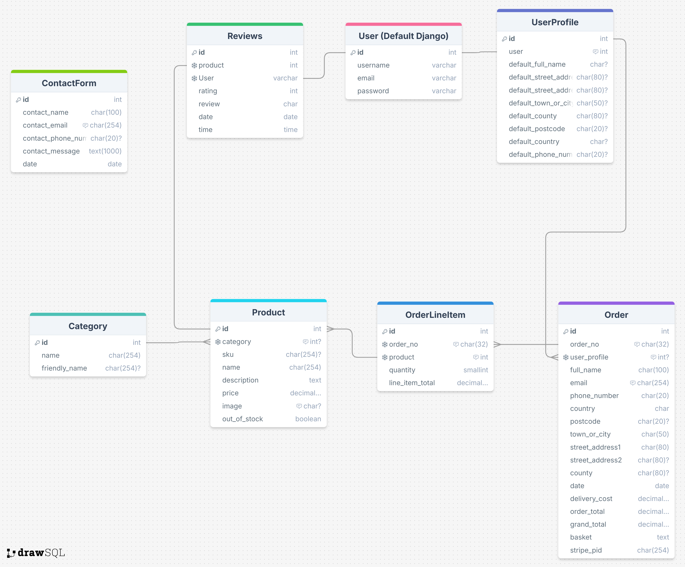

# Fourth Milestone Project

# Floral Design

## Link to live website

## Table of Contents

- [Third Milestone Project](#third-milestone-project)
- [Floral Design](#floral-design)
- [Table of Contents](#table-of-contents)
- [About](#about)
- [Strategy](#strategy)
- [User Experience (UX)](#user-experience-ux)
- [Design](#design)
  - [Colour Scheme](#colour-scheme)
  - [Typography](#typography)
  - [Imagery](#imagery)
  - [Wireframes](#wireframes)
  - [Flowcharts](#flowcharts)
  - [Data Schema](#data-schema)
- [Styles](#styles)
  - [CSS](#css)
- [Floral Design Pages](#floral-design-pages)
  
- [Accessibility](#accessibility)
- [Technologies used](#technologies-used)
- [Deployment](#deployment--local-development)
- [Testing](#testing)
- [Bugs](#bugs)
- [Credits](#credits)

## About

Floral Design is a B2C e-commerce store which is built on a buissness in the making, my wife is currently working on opening a flower buissnes. The site at the moment is not for real purchases, but is built with the potential to become fully funtional in the future. The website is designed and implemented with Python and Django, HTML, CSS and some Javascript. It specialises in selling ready made flower arrangements to consumers online. However it has to be noted that this site does not yet sell the products.

## Home Page
![Home page]

### Strategy
* Pack and Stash is a B2C type of business. Due to pressure of life amongst us from work/business, many of us are now opting for online shopping. Floral Design aims to offer flexible online shopping to its customers.

# User Experience (UX)

Floral Design is a Business to Consumer (B2C) e-commerce site.

The sites primary audience will be people who want to be able to shop for a range of flower arangements and designs, in one place.

## User Stories

| User Story ID | User | Should be able to ... | To ... |
| :--- | :--- | :--- | :---|
| **VIEWING & NAVIGATION** |
| 1 | Shopper | View a list of products| Select something to purchase |
| 2 | Shopper | View a specific category of products | Quickly find products I'm interested in without having to search through all products. |
| 3 | Shopper | View individual product details | Identify the price, description, product rating and product image. |
| 4 | Shopper| Quickly identify deals and special offers | Take advantage of special savings on products I'd like to purchase. |
| 5 | Shopper | Easily view the total of my purchases at any time | Avoid spending too much. |
| **REGISTRATION & USER ACCOUNTS** |
| 6 | Site User | Easily register for an account| Have a personal account and profile |
| 7 | Site User | Easily log in or out | Access account information |
| 8 | Site User | Easily recover password | Recover access to account |
| 9 | Site User | Receive an email confirmation after registering | Verify account registration was successful |
| 10 | Site User | Have a personalised user profile | View order history and order confirmations, and save  payment information |
| **SORTING & SEARCHING** |
| 11 | Shopper | Sort the list of available products | Easily identify the best rated, best priced and categorically sort products |
| 12 | Shopper | Sort a specific category of product | Find the best-priced or best-rated product in a specific category, or sort the products in that category by name |
| 13 | Shopper | Sort multiple categories of products simultaneously | Find the best-priced or best-rated products across broad categories |
| 14 | Shopper | Search for a product by name or description | Find a specific product I'd like to purchase |
| 15 | Shopper | Easily see what I've searched for and the number of results | Quickly decide whether the product I want is available |
| **PURCHASING & CHECKOUT** |
| 16 | Shopper | Easily select the quantity of a product when purchasing it | Ensure no accidental selection of the wrong product or quantity |
| 17 | Shopper | View items in bag to be purchased | Identify the total cost, and the items of the purchase |
| 18 | Shopper | Adjust the quantity of individual items in the bag| Easily make changes to the purchase before checkout |
| 19 | Shopper | Easily enter payment information | Check out swiftly and easily |
| 20 | Shopper | Feel personal and payment information is safe and secure | Confidently provide the needed information to make a purchase |
| 21 | Shopper | View an order confirmation after checkout | Verify that no mistakes have been made |
| 22 | Shopper | Receive an email confirmation after checking out | Keep a record of the purchase |
| **ADMIN & STORE MANAGEMENT** |
| 23 | Store Owner | Add a product | Add new items to my store |
| 24 | Store Owner | Edit/update a product | Change product prices, descriptions, images and other product criteria |
| 25 | Store Owner | Delete a product | Remove items that are no longer for sale |

# Design

## Colour Scheme

I designed my colour scheme, based on the Floral Design logo. The design I recieved from my client, this logo was previously used by my client for advertising and other buissness needs. Based on the colour of the logo I have designed the website. The pink colour gives users the feeling, they are visitong a safisticated flower e-comerce site. The grey color has a pink undertone wich matches well the main pink colour of the logo.

- I have used `#e6423d` for the most header and nav texts of the web pages.
- I have used `#806161` for side texts and paragraphs.
- I have used `rgba(230, 66, 61, 0.5)` as an opaque version of the main text colour.
- I have used `rgba(128, 97, 97, 0.4)` as an opaque version of the side text colour.
- I have used `rgba(230, 66, 61, 0.3)` for the lighter opaque colour of the footer.
- I have used plain white `#fff` for the white text in the dark background sections of the web pages.
- I have used plain white `#fff` for the white background for many sections of the web pages.

### Typography

* The main font used in this website is Federo. This font is clear to read yet decrative, giving the customer a unique experiance when browsing the products and pages of the site. The font is available in a wide range of weights. The user will never have to strain to read any section.

- - -

* The font is imported from google fonts. [Federo](https://fonts.google.com/?query=Federo) It is used via the import link at the head of the [stylesheet](static/css/base.css). This links all the text across the pages of the website to the appropriate style and font.

* The decrotive font used in this website is Merienda. This font is decrative, giving the customer a unique experiance of a bespoke flower e-comerce site. The font is used for informaiton on the hero image and for the text of the shop now button.

- - -

* The font is imported from google fonts. [Merienda](https://fonts.google.com/?query=Merienda) It is used via the import link at the head of the [stylesheet](static/css/base.css). This links all the text across the pages of the website to the appropriate style and font.

### Imagery

For the hero images i have used two very different images of flower designs, these images on the home cann be changed by clicking on the arrows to the right and left of the hero image. The functions to change images are with [javascript](static/js/base.js). The images come from [pixabay](https://pixabay.com/).

### Product Image

The product images are from a range of sources. Some a from an original photo shoot created by my client for a previous advertisment. Some are flower designs created around the time I was creating the website. Some come from [pixabay](https://pixabay.com/)

## Wireframes

  
Click here to view Wireframes:

Wireframes were created for mobile, tablet and desktop using [balsamiq.](https://balsamiq.com/)

### Home Page

---

### Products Page

---

### Product Detail page

---

### Basket page

---

### Checkout page

---

### All Forms

#### All pages on the website, which have forms will all have similar layout.

* Sign up
* Log in
* Contact form
* Add Review
* Admin product add and edit

---

### Data Schema

  
Click here to view the data schema:

Due to the data being used for the project I have opted to use a relational database as this will best suit my requirements.

- I created the schema using the website [drawsql](https://drawsql.app/). The schema shows the data layout and how it is used across the various apps in the website, using ids and foreign keys.

# Bugs

* Navbar not showng in mobile

* Product images not loading

* Dev tools showing error in js file

* bug in product_count tag

* bug in message remove jquery

* opening checkout template rendred form error from checkout/views.py

* Messages would not close on login and logout

* Username input bug on reviews form

