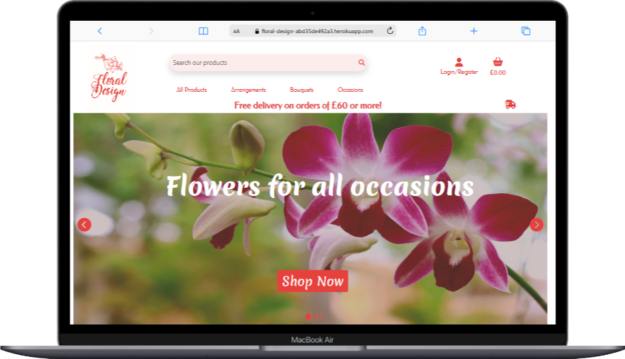

# Floral Design - Tests

## CONTENTS
* [Site responsivness](#floral-esign-is-responsive-to-all-devices)
* [AUTOMATED TESTING](#automated-testing)
  * [W3C Validator](#w3c-validator)
  * [Lighthouse](#lighthouse)
* [JavaScript test](#jshint-java-script-test)
* [Full Testing](#full-testing)
  * [Testing User Stories](#testing-user-stories)
  * [MANUAL TESTING](#manual-testing)

## Floral Design is responsive to all devices.

  
Click here to view Responsive pages:

### Home page

---

---

---

### Products page

---

---

---

### Product Detail page

---

---

---

### Basket Page

---

---

---

### Checkout page

---

---

---

### Checkout Success page

---

---

---

### Product Management Page

---

---

---

### Profile Page

---

---

---

### Review page

---

---

---

### Contact Page

---

---

---

### Sign in Page

---

---

---

### Sign out Page

---

---

---

### Sign Up page

---

---

---

### Delivery page

---

---

---

## AUTOMATED TESTING

### W3C Validator

I used [W3C Validator](https://validator.w3.org/) to validate the HTML on all pages of the website.

I used [W3C Jigsaw Validator](https://jigsaw.w3.org/css-validator/) to validate the CSS file.

### Home page

### Products page

### Product details page

### Basket Page

### Checkout page

### Checkout Success page

### Sign in page

### Contact Page

### Add Review Page

### Add Product Page

### Edit Product Page

---

### CSS checker

The css check came back with no errors, 

### Jshint Java Script test

 * My code is written using ES6 JavaScript syntax. The let key word was flagged as a warning by jshint.
 * No other warnings were present.
 * script.js

 
 
 - - -

 ### Python linter test

 * After putting my app.py file to the linter test, it passed with no errors

 

 - - -

 ## Lighthouse validation

 

  
For lighthouse images click here

 I put all pages throught he lighthluse validation and they passed with at least 70% many with over 80%.

 
 ### Home Page

 

 ### Products Page

 ### Basket Page

 

 ### Checkout Page

### Checkout success

 

 ### Product management

 ### Reviews Page

 

 ### Contact Page

### Sign In

### Sign Up

### Sign out

### Delivery Page

---

# Testing use stories

## User Stories

| User Story ID | User | Should be able to ... | To ... | Test done | Pass/Fail |
| :--- | :--- | :--- | :---|
| **VIEWING & NAVIGATION** |
| 1 | Shopper | View a list of products| Select something to purchase | Opened products page and put item in basket. | Pass |
| 2 | Shopper | View a specific category of products | Quickly find products I'm interested in without having to search through all products. | Selected specific category, only a few items were displayed. | Pass |
| 3 | Shopper | View individual product details | Identify the price, description, product rating and product image. | Clicked on product to view all the relavant informaiton was clearly displayed. | Pass |
| 4 | Shopper| Quickly identify deals and special offers | Take advantage of special savings on products I'd like to purchase. | Filtered the product list, to price from low to high, showed the cheapest product. | Pass |
| 5 | Shopper | Easily view the total of my purchases at any time | Avoid spending too much. | After every item is added to basket, basket total is clearly displayed under basket icon. | Pass |
| **REGISTRATION & USER ACCOUNTS** |
| 6 | Site User | Easily register for an account| Have a personal account and profile | Registered and opened personal profile page. | Pass |
| 7 | Site User | Easily log in or out | Access account information | Logged in from nav link and then signed out. | Pass |
| 8 | Site User | Have a personalised user profile | View order history and order confirmations, and save  payment information | Made a few purchses and checked profile, all order history was present. | Pass |
| **REVIEWING PRODUCTS** |
| 9 | Site Owner | Have a place for customer ratings and reviews. | To attract new customers to buy our 5 star rated products. | There is a clear review button and submit form on every product page. | Pass |
| 10 | Site User | Have an ability to review and rate products | To inform other users of the advanteges os disadvantages of any product. | Opened product clicked review item button, filled in review form and rated item, after submiting review the rating and review were displayed on the product page. | Pass |
| 11 | Shopper | Have customer rating and reviews | To see the how content past customers are, with each product. | After opening a product it had a review and rating from a past customer. | Pass |
| **SORTING & SEARCHING** |
| 12 | Shopper | Sort the list of available products | Easily identify the best rated, best priced and categorically sort products | A simple to use sort by filter is on th eproducts page. | Pass |
| 13 | Shopper | Sort a specific category of product | Find the best-priced or best-rated product in a specific category, or sort the products in that category by name | Easy to use category filter and search bar. | Pass |
| 14 | Shopper | Sort multiple categories of products simultaneously | Find the best-priced or best-rated products across broad categories | The main shopping page has all categories and it can be sorted by price accross all categories. There is also sub category buttons, which display a cobination of some categories. These can be sorted by price name and category. | Pass |
| 15 | Shopper | Search for a product by name or description | Find a specific product I'd like to purchase | Used the search bar. | Pass |
| 16 | Shopper | Easily see what I've searched for and the number of results | Quickly decide whether the product I want is available | Clear display of searched for items and number of resutls on top of products page. | Pass |
| **PURCHASING & CHECKOUT** |
| 17 | Shopper | Easily select the quantity of a product when purchasing it | Ensure no accidental selection of the wrong product or quantity |
| 18 | Shopper | View items in bag to be purchased | Identify the total cost, and the items of the purchase |
| 19 | Shopper | Adjust the quantity of individual items in the bag| Easily make changes to the purchase before checkout |
| 20 | Shopper | Easily enter payment information | Check out swiftly and easily |
| 21 | Shopper | Feel personal and payment information is safe and secure | Confidently provide the needed information to make a purchase |
| 22 | Shopper | View an order confirmation after checkout | Verify that no mistakes have been made |
| 23 | Shopper | Receive an email confirmation after checking out | Keep a record of the purchase |
| **ADMIN & STORE MANAGEMENT** |
| 24 | Store Owner | Add a product | Add new items to my store |
| 25 | Store Owner | Edit/update a product | Change product prices, descriptions, images and other product criteria |
| 26 | Store Owner | Delete a product | Remove items that are no longer for sale |