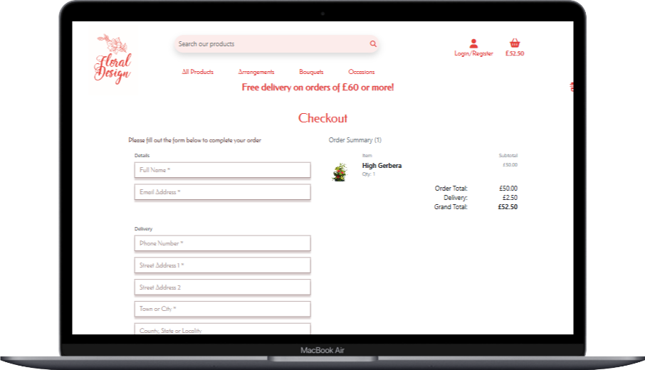
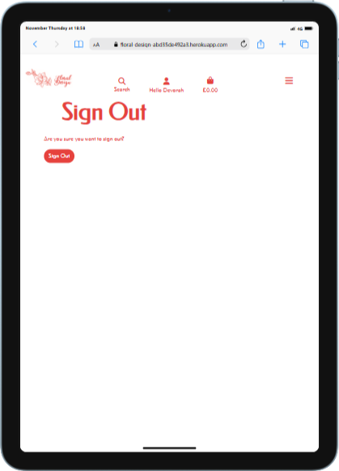
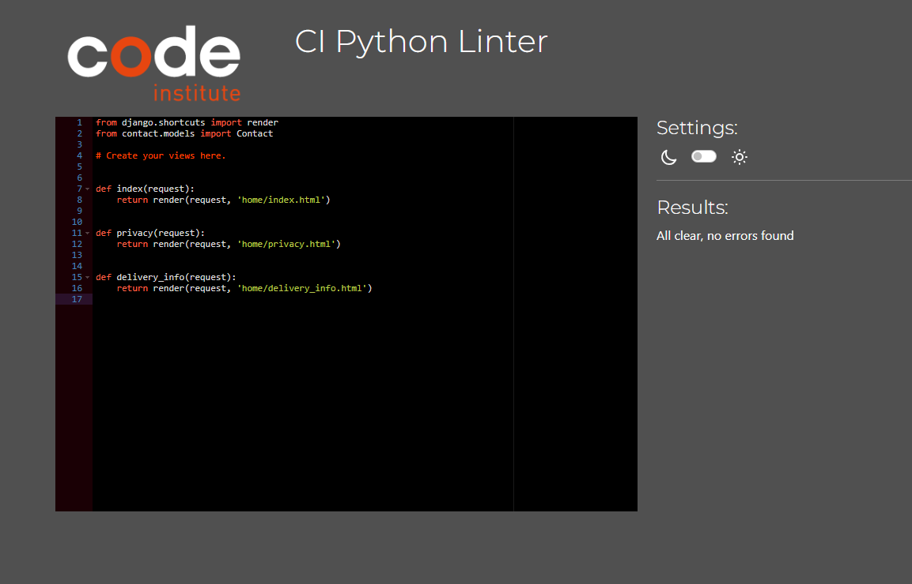
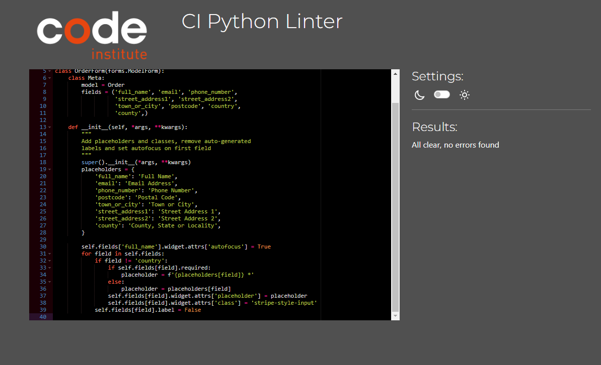

# Floral Design - Tests

## CONTENTS
* [Site responsiveness](#floral-design-is-responsive-to-all-devices)
* [AUTOMATED TESTING](#automated-testing)
  * [W3C Validator](#w3c-validator)
  * [Lighthouse](#lighthouse)
* [JavaScript test](#jshint-java-script-test)
* [Python test](#python-linter-test)
* [Full Testing](#full-testing)
  * [Testing User Stories](#testing-user-stories)
  * [MANUAL TESTING](#manual-testing)

## Floral Design is responsive to all devices.

  
Click here to view Responsive pages:

### Home page

---

---

---

### Products page

---

---

---

### Product Detail page

---

---

---

### Basket Page

---

---

---

### Checkout page

---

---

---

### Checkout Success page

---

---

---

### Product Management Page

---

---

---

### Profile Page

---

---

---

### Review page

---

---

---

### Contact Page

---

---

---

### Sign in Page

---

---

---

### Sign out Page

---

---

---

### Sign Up page

---

---

---

### Delivery page

---

---

---

## AUTOMATED TESTING

### W3C Validator

I used [W3C Validator](https://validator.w3.org/) to validate the HTML on all pages of the website.

* I will attach the home and products page HTML validator as samples to all the pages of the site, which passed the same tests.

---

### Home page

### Products page

### CSS checker

I used [W3C Jigsaw Validator](https://jigsaw.w3.org/css-validator/) to validate the CSS file.

The CSS check came back with no errors, 

## Lighthouse Testing

* All pages of the website have been through lighthouse tests and passed with scores above 70 and 80.
### Home page

### products page

### basket page

### checkout page

### checkout success page

### reviews page

### contact page

### sign up page

### sign in page

### sign out page

### Product management page

### delivery page

### Joshing JavaScript test

 * The JavaScript code all past the Joshing test.

 
 
 - - -

## Python linter test

  
Click to view python tests

* After putting all .py file to the linter test, they passed with no errors

### Project level App

#### Settings.py

 

 #### urls.py

 

 - - -

 ### Home app

 #### views.py

 

 #### urls.py

 

 - - -

 ### Products app

 #### views.py

 

 #### models.py

 

 #### admin.py

 

 #### urls.py

 

 - - - 

 ### Profile app

 #### views.py

 #### models.py

 

 #### forms.py

 

 #### urls.py

 

 - - -

### Basket app

#### views.py

 #### models.py

 #### admin.py

 

 - - -

### Checkout app

#### views.py

 #### models.py

 

 #### admin.py

 

 #### forms.py

 

 #### signals.py

 

 #### urls.py

 

 - - -

### Contact App

#### views.py

 #### models.py

 

 #### admin.py

 

 #### forms.py

 

 #### urls.py

 

 - - -

# Testing user stories

## User Stories

| User Story ID | User | Should be able to | To | Test done | Pass/Fail |
| :--- | :--- | :--- | :---| :---| :---|
| **VIEWING & NAVIGATION** |
| 1 | Shopper | View a list of products| Select something to purchase | Opened products page and put item in basket. | Pass |
| 2 | Shopper | View a specific category of products | Quickly find products I'm interested in without having to search through all products. | Selected specific category, only a few items were displayed. | Pass |
| 3 | Shopper | View individual product details | Identify the price, description, product rating and product image. | Clicked on product to view all the relevant information was clearly displayed. | Pass |
| 4 | Shopper| Quickly identify deals and special offers | Take advantage of special savings on products I'd like to purchase. | Filtered the product list, to price from low to high, showed the cheapest product. | Pass |
| 5 | Shopper | Easily view the total of my purchases at any time | Avoid spending too much. | After every item is added to basket, basket total is clearly displayed under basket icon. | Pass |
| **REGISTRATION & USER ACCOUNTS** |
| 6 | Site User | Easily register for an account| Have a personal account and profile | Registered and opened personal profile page. | Pass |
| 7 | Site User | Easily log in or out | Access account information | Logged in from nav link and then signed out. | Pass |
| 8 | Site User | Have a personalised user profile | View order history and order confirmations, and save payment information | Made a few purchases and checked profile, all order history was present. | Pass |
| **REVIEWING PRODUCTS** |
| 9 | Site Owner | Have a place for customer ratings and reviews. | To attract new customers to buy our 5 star rated products. | There is a clear review button and submit form on every product page. | Pass |
| 10 | Site User | Have an ability to review and rate products | To inform other users of the advantages and disadvantages of any product. | Opened product clicked review item button, filled in review form, and rated item, after submitting review the rating and review were displayed on the product page. | Pass |
| 11 | Shopper | Have customer rating and reviews | To see the how content past customers are, with each product. | After opening a product, it had a review and rating from a past customer. | Pass |
| **SORTING & SEARCHING** |
| 12 | Shopper | Sort the list of available products | Easily identify the best rated, best priced and categorically sort products | A simple to use sort by filter is on the products page. | Pass |
| 13 | Shopper | Sort a specific category of product | Find the best-priced or best-rated product in a specific category or sort the products in that category by name | Easy to use category filter and search bar. | Pass |
| 14 | Shopper | Sort multiple categories of products simultaneously | Find the best-priced or best-rated products across broad categories | The main shopping page has all categories, and it can be sorted by price across all categories. There are also category buttons, which display a combination of categories. These can be sorted by price name and category. | Pass |
| 15 | Shopper | Search for a product by name or description | Find a specific product I would like to purchase | Used the search bar. | Pass |
| 16 | Shopper | Easily see what I have searched for and the number of results | Quickly decide whether the product I want is available | Clear display of searched for items and number of results on top of products page. | Pass |
| **PURCHASING & CHECKOUT** |
| 17 | Shopper | Easily select the quantity of a product when purchasing it | Ensure no accidental selection of the wrong product or quantity | The products are displayed and described clearly, the shopper would not accidentally select the wrong item. | Pass |
| 18 | Shopper | View items in bag to be purchased | Identify the total cost, and the items of the purchase | Total cost and number of items ore clearly displayed, both in the basket and by checkout. | Pass |
| 19 | Shopper | Adjust the quantity of individual items in the bag| Easily amend the purchase before checkout | Simple quantity adjuster in the basket. | Pass |
| 20 | Shopper | Easily enter payment information | Check out swiftly and easily | A very simple and safe checkout system using stripe. | Pass |
| 21 | Shopper | Feel personal and payment information is safe and secure | Confidently provide the needed information to make a purchase | All personal information stored on the website, is only available for the user when logged in. | Pass |
| 22 | Shopper | View an order confirmation after checkout | Verify that no mistakes have been made | A clear full page order confirmation, is displayed with all relevant information on. | Pass |
| **ADMIN & STORE MANAGEMENT** |
| 23 | Store Owner | Add a product | Add new items to my store | A simple to use product management form allows for new products to be added to store. | Pass |
| 24 | Store Owner | Edit/update a product | Change product prices, descriptions, images and other product criteria | A simple to use product management form allows for update and edits on all products. | Pass |
| 25 | Store Owner | Delete a product | Remove items that are no longer for sale | A delete button is available for admin only to delete any product. | Pass |

- - -

## Full Testing

Full testing was performed on the following devices:

* Laptop:
  * Lenovo
  * HP
* Mobile Devices:
  * Android Tablet

Each device assessed the site using the following browsers:

* Google Chrome
* Microsoft Edge
* Opera

Additional testing was taken by friends and family, on a variety of devices and screen sizes. They reported no issues whilst using the app.

Each page was run through a mobile simulator extension (Images above) to showcase the entire site on a variety of devices.

- - -

## Manual testing 

### Home Page

| Feature | Expected Outcome | Testing Performed | Result | Pass/Fail |
| --- | --- | --- | --- | --- |
| Home logo. | Link back to home page. | Clicked on logo. | Home page reloads. | Pass |
| Home link. | Link back to home page. | Clicked on Home link. | Home page reloads. | Pass |
| Sign in link. | Link to Sign in page. | Clicked on link. | Sign in page loads. | Pass |
| Sign up link. | Link to Sign up page. | Clicked on link | Sign up page loads. | Pass |
| Shop now link. | Link to products page. | Clicked on link. | Products page loads. | Pass |
| Mobile nav links hamburger. | Toggles open nav bar on mobile devices. | Clicked on hamburger icon. | Side nav bar toggles open. | Pass |
| Search bar. | User can type in search request, any product with the search criteria will load. | Type in search request. | Products with search criteria load. | Pass |

### Products page

| Feature | Expected Outcome | Testing Performed | Result | Pass/Fail |
| --- | --- | --- | --- | --- |
| Product displays | All products should be displayed. | Page loaded. | All the products are displayed. | Pass |
| Sort by filter. | Changes order of products display by price, category or name. | Select a sort by. | All products are listed in the requested order. | Pass |
| Product Add to basket | Should add product to basket. | Click button. | Product added to basket. | Pass |
| Category filter. | Buttons with category name displayed at top of page. | Select a button. | All products of that category load. | Pass |
| Back to top scrolling button | When scrolling down the page, a button should appear. | Scrolled down page. | Button appeared. | Pass |
| Back up button | Clicking on the button, should scroll page back to top. | Clicked on the button. | Page scrolled back to top. | Pass |

### Products display page

| Feature | Expected Outcome | Testing Performed | Result | Pass/Fail |
| --- | --- | --- | --- | --- |
| Quantity Selector | Should allow user to select a quantity of the product. | Selected quantity. | Basket updated. | Pass |
| Add to basket | Should be able to add product to basket. | Click on add to basket button. | Product is added to basket. | Pass |
| Edit link | Admin should be able to edit product, when clicking on edit button. | Clicked on edit trip button. | Edit product form opens. | Pass |
| Delete link | Admin should be able to delete product, when clicking on delete. | Clicked on delete. | Product is removed from website. | Pass |
| Add review | User should be able to review a product, when clicking on review button. | Clicked on review button. | Review product form opens. | Pass |

- - -

### Basket page
| Feature | Expected Outcome | Testing Performed | Result | Pass/Fail |
| --- | --- | --- | --- | --- |
| Update basket in basket page | Should be able to add or remove items from basket page itself. | Clicked on the delete and update button. | Basket updated | Pass |
| Checkout from basket | A user should be able to checkout from the basket | Clicked the checkout button | Checkout page loaded. | Pass |

- - -

### Checkout page
| Feature | Expected Outcome | Testing Performed | Result | Pass/Fail |
| --- | --- | --- | --- | --- |
| Checkout and pay for items | A user should be able to pay for their items with the website. | Filled in checkout form and payment details. | Payment successful | Pass |
| Empty Basket | After checkout the basket should empty | Checked out | The basket emptied | Pass |

 - - -

### Review page
| Feature | Expected Outcome | Testing Performed | Result | Pass/Fail |
| --- | --- | --- | --- | --- |
| Rate and review an item | A user should review an item purchased. | Fill in review form. | Review loads on that product's page. | Pass |
| Rating stars | Number of stars to show on product review, should correspond to rating number user puts into the input form. | Added various different reviews with a product. | Number of stars corresponded with value user put into form. | Pass |
- - -

## Contact page
| Feature | Expected Outcome | Testing Performed | Result | Pass/Fail |
| --- | --- | --- | --- | --- |
| Customer contact form | Customer should be able to contact owner via the website. | Filled in a contact from. | Contact message is submitted. | Pass |

### Sign up Page

| Feature | Expected Outcome | Testing Performed | Result | Pass/Fail |
| --- | --- | --- | --- | --- |
| Sign up form. | When loaded the page should have a form, which user information can be put in. | On page load form appears. | User information can be added. | Pass |
| Sign up button. | When clicking on sign up button user should be added to data base and be signed in. | Clicked on sign up button. | User was added to data base and signed in. | Pass |
- - -

### Sign in Page

| Feature | Expected Outcome | Testing Performed | Result | Pass/Fail |
| --- | --- | --- | --- | --- |
| Sign in link. | Link to Sign in page. | Clicked on link. | Sign in page loads. | Pass |
| Sign in form. | When loaded the page should have a form, which user information can be put in. | On page load form appears | User information can be added. | Pass |
| Sign in button. | When clicking on sign in button, user should be signed in. | Clicked on sign in button. | User was signed in. | Pass |

 - - -

### Sign out Page

| Feature | Expected Outcome | Testing Performed | Result | Pass/Fail |
| --- | --- | --- | --- | --- |
| Sign out link. | Link to Sign out page. | Clicked on link. | Sign out page loads. | Pass |
| Sign out button. | When clicking on sign in button, user should be signed out. | Clicked on sign out button. | User was signed out. | Pass |

 ### Add product Page

| Feature | Expected Outcome | Testing Performed | Result | Pass/Fail |
| --- | --- | --- | --- | --- |
| Add product form. | When loaded the page should have a form, where admin could add a new product. | On page load form appears. | Product information can be added. | Pass |
| Add image button | When clicking on button file explorer should open to allow image upload. | Clicked on add image | File explorer opens, image loads to data base. | Pass |
| Submit button. | When clicking on submit button, product should be added to data base and trips page display. | Clicked on submit button. | product was added. | Pass |
 - - -

 ### Edit product Page

 | Feature | Expected Outcome | Testing Performed | Result | Pass/Fail |
| --- | --- | --- | --- | --- |
| Edit product form. | When loaded the page should have a form, where admin could edit a product. | On page load form appears. | Product information can be edited. | Pass |
| Out of stock checkbox | When the checkbox is checked product should be displayed as out of stock on products page | Checked out of stock | Product was displayed as out of stock | Pass |
| Add image button | When clicking on button file explorer should open to allow image upload. | Clicked on add image | File explorer opens, image loads to data base. | Pass |
| Submit button. | When clicking on submit button, product should be added to data base and trips page display. | Clicked on submit button. | product was added. | Pass |

- - -

